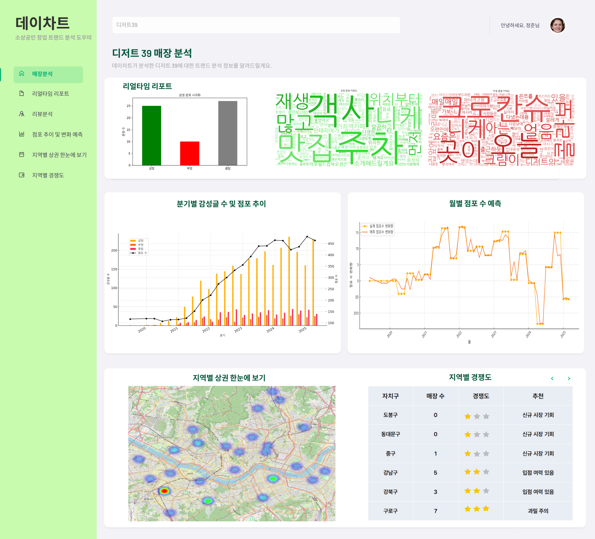
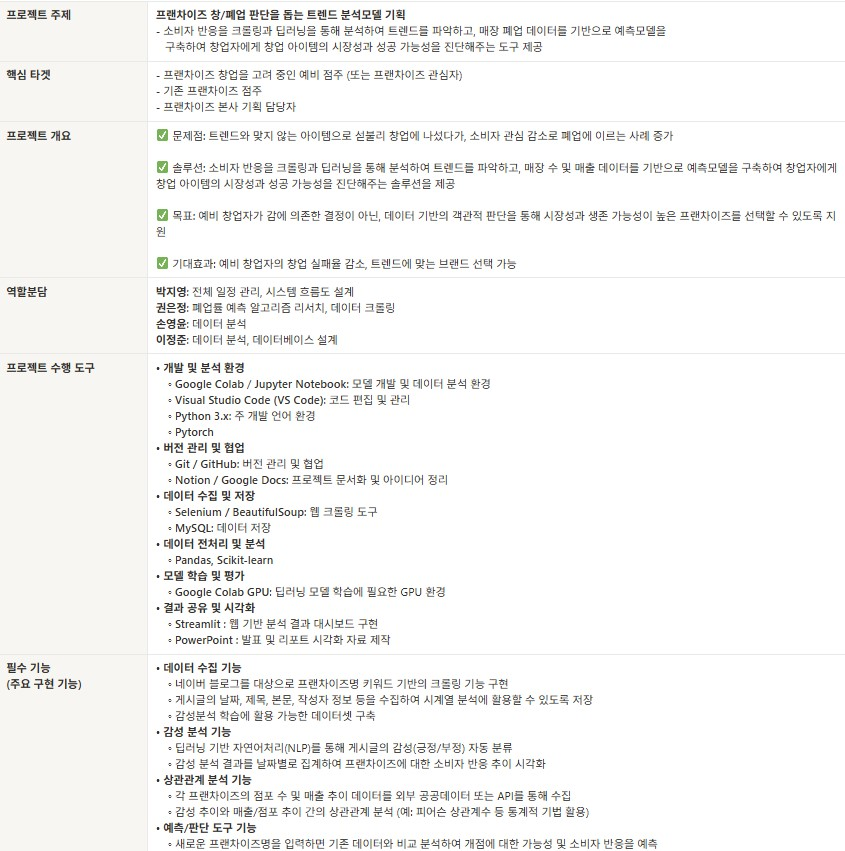
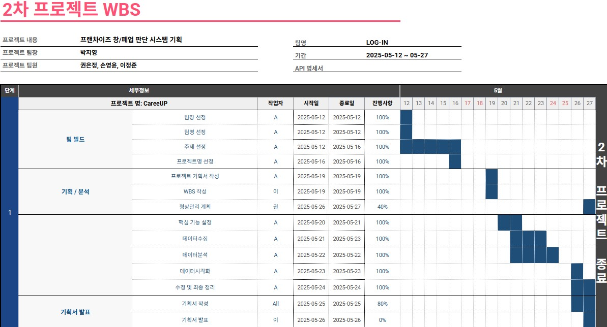
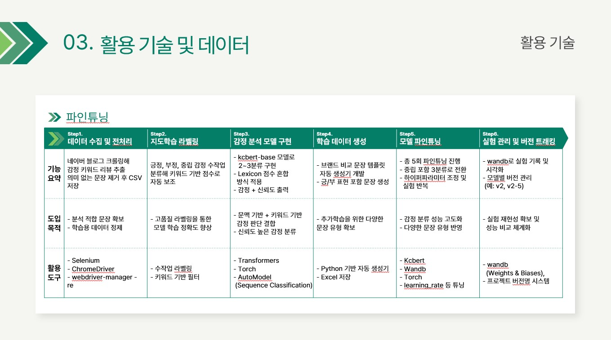
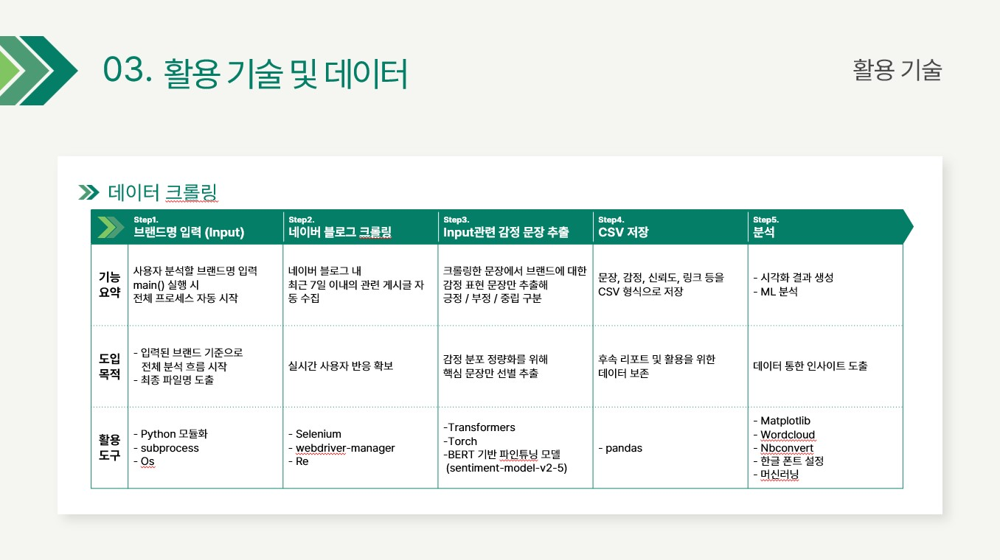
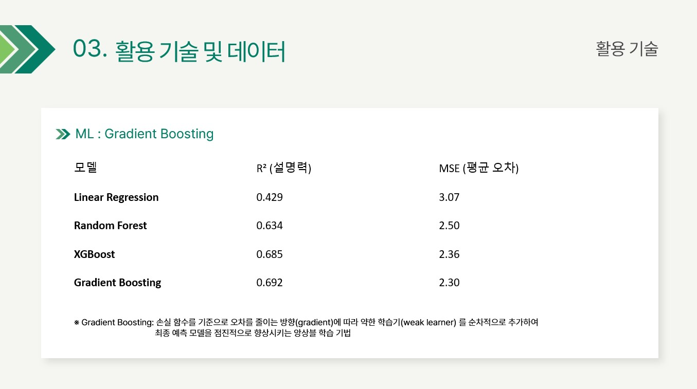
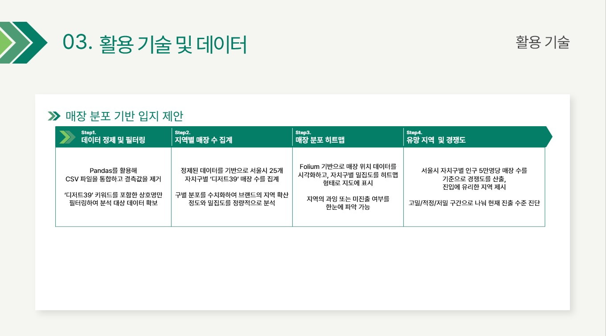

# fa05-2st-Login
KPMG_future_academy05_login 두 번째 프로젝트
-----------------

# 프로젝트 기획서

## 1. 프로젝트 개요
### 1. 프로젝트 주제: **프랜차이즈 창/폐업 판단을 돕는 트렌드 분석모델 기획**
### 2. 프로젝트 목표: 소비자 반응을 크롤링과 딥러닝을 통해 분석하여 트렌드를 파악하고, 매장 폐업 데이터를 기반으로 예측모델을 구축하여 창업자에게 창업 아이템의 시장성과 성공 가능성을 진단해주는 도구 제공
- 홈페이지

- 메인페이지

### 3. 주요 구현 기능
- 데이터 수집 기능
- 감성 분석 기능
- 상관관계 분석 기능
- 예측/판단 도구 기능
- 시각화 및 리포트 기능

## 2. 프로젝트 일정
| 작업 항목                  | 시작 날짜   | 종료 날짜   | 기간(일) |
|---------------------------|------------|------------|---------|
| Kickoff meeting           | 2025-05-12 | 2025-05-12 | 1       |
| 프로젝트 주제선정            | 2025-05-13 | 2025-05-16 | 4       |
| 프로젝트 구체화 및 계획서 작성 | 2025-05-17 | 2025-05-19 | 3       |
| 데이터 분석 및 모델 개발      | 2025-05-20 | 2024-05-25 | 6       |
| 피그마 작업 및 ppt 작성      | 2025-05-26 | 2025-05-26 | 1       |
| 최종 검토 및 프로젝트 발표    | 2025-05-27 | 2025-05-27 | 1       |

## 3. 프로젝트 계획서

 

# 2차 WBS

# 활용 기술 및 데이터

## 1. 파인튜닝

## 2. 데이터 크롤링

## 3. ML : Gradient Boosting

## 4. 매장 분포 기반 입지 제안

## 5. 데이터
- 소상공인시장진흥공단 상가(상권)정보
- 네이버 블로그 리뷰

# 발표 자료
## 📄 v1.0_Report

# 프로젝트 Lesson Learn
- 데이터 확보 가능성을 고려하여 주제 선성 필요
- 챗gpt에 요구사항을 하나씩 반영하는 것이 디버깅이 용이하고 코딩 속도 향상
- 챗gpt에 반복적인 데이터분석시 원본 데이터로 분석하는 대신, 정제된 데이터를 저장하여 사용
- 프로젝트 초기, 작업범위/업무량 기반에 정확한 R&R 선정 필요

